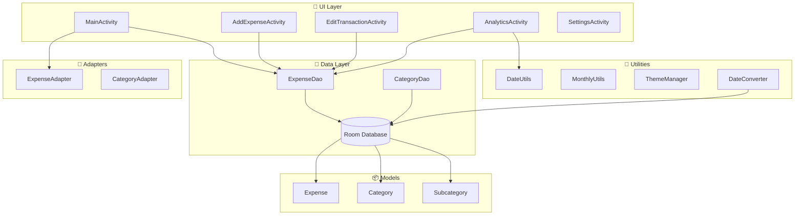
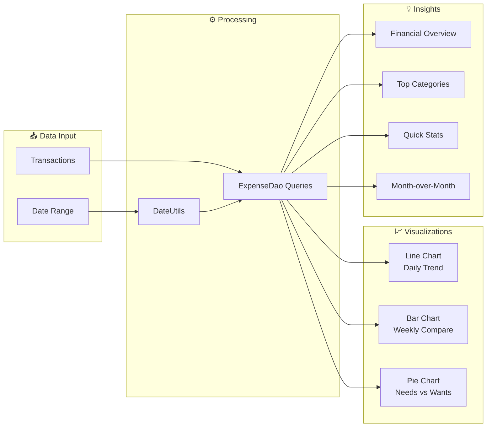
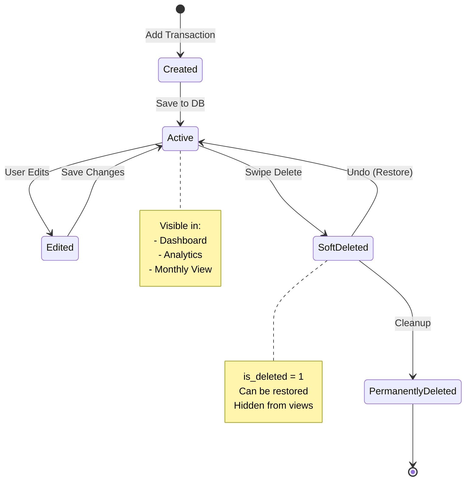
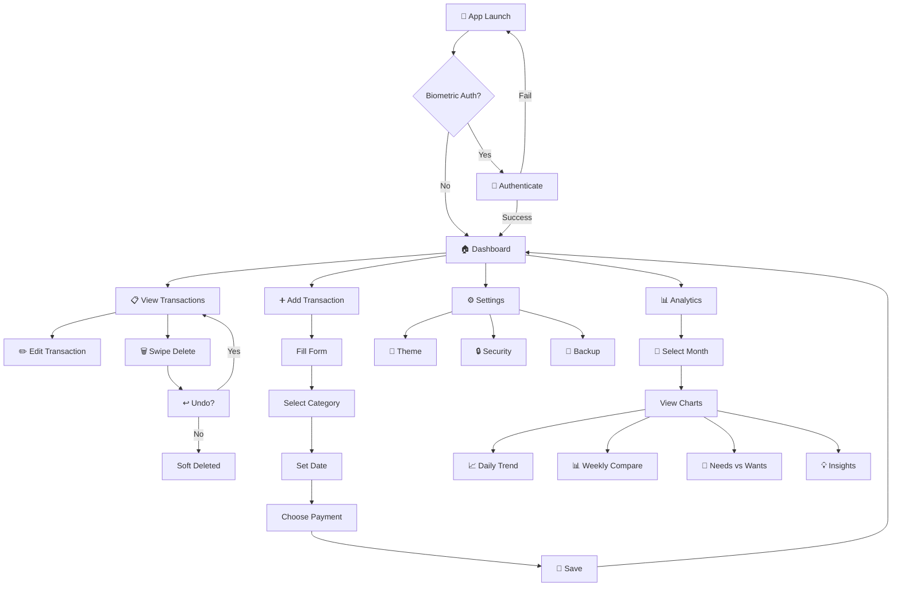
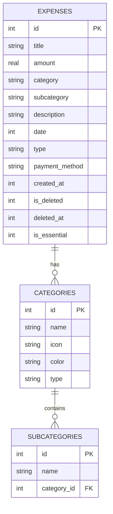

# 💰 ExpenseTracker Pro

> A modern, feature-rich expense tracking Android application built with Java


## 📱 Overview

ExpenseTracker Pro is a comprehensive personal finance management app that helps users track their income and expenses, analyze spending patterns, and maintain financial health. Built with modern Android development practices and Material Design principles.

## 🏗️ App Architecture



## 📊 Analytics Flow



## ✨ Features

### 💳 **Core Functionality**

- **Income & Expense Tracking**: Add, edit, and delete financial transactions
- **Category Management**: Predefined and custom categories with subcategories and color coding
- **Payment Methods**: Support for Cash, Card, UPI, and Bank transfers
- **Real-time Balance**: Automatic calculation of total balance
- **Search & Filter**: Find transactions by date, category, or amount
- **Swipe to Delete**: Quick transaction removal with undo support
- **Soft Delete & Restore**: Recover accidentally deleted transactions

### 📅 **Monthly Tracking**

- **Month Selector**: Navigate between months with intuitive UI
- **Monthly Summary**: Income, expenses, and balance for each month
- **Category Breakdown**: See spending by category per month
- **Budget Progress**: Track spending against monthly budget
- **Empty State Handling**: Clear prompts when no transactions exist

### 📊 **Analytics & Insights**

- **Financial Overview**: Total income, expenses, balance, and savings rate
- **Daily Spending Trend**: Line chart showing daily expenses with budget limit line
- **Weekly Comparison**: Bar chart comparing spending across the last 4 weeks
- **Needs vs Wants**: Pie chart showing essential vs non-essential spending breakdown
- **Top Spending Categories**: Visual ranking of your highest expense categories
- **Quick Insights**: Transaction count, highest expense, daily average
- **Month-over-Month Comparison**: Track spending changes between months
- **Spending Tips**: AI-generated recommendations based on your spending patterns

### 🔒 **Security Features**

- **Biometric Authentication**: Fingerprint and face unlock support
- **Data Encryption**: Secure local data storage
- **Backup & Restore**: Cloud backup integration
- **Privacy Controls**: App lock and secure access

### 🎨 **User Experience**

- **Material Design**: Modern, intuitive interface
- **Dark/Light Theme**: Customizable appearance with ThemeManager
- **Responsive Layout**: Optimized for all screen sizes
- **Smooth Animations**: Enhanced user interactions with chart animations
- **Offline Support**: Works without internet connection
- **Interactive Charts**: MPAndroidChart integration for beautiful visualizations

## 🛠️ Tech Stack

**Architecture:**

- MVVM (Model-View-ViewModel) pattern
- Repository pattern for data management
- LiveData and ViewModel for reactive UI

**Database:**

- Room Database (SQLite)
- DAO (Data Access Objects)
- Type converters for complex data

**UI/UX:**

- Material Design Components
- RecyclerView with custom adapters
- CoordinatorLayout for complex interactions
- Custom animations and transitions

**External Libraries:**

- MPAndroidChart (Data visualization)
- Material DateTime Picker
- Glide (Image loading)
- Biometric API

## � Transaction Lifecycle



## �🚀 Getting Started

### Prerequisites

- Android Studio Arctic Fox or later
- Android SDK 24 (Android 7.0) or higher
- Java 8 or higher

### Installation

1. **Clone the repository**

   ```bash
   git clone https://github.com/VishnuKant0925/ExpenseTrackerPro.git
   cd ExpenseTrackerPro
   ```

2. **Open in Android Studio**

   - Launch Android Studio
   - Click "Open an existing Android Studio project"
   - Navigate to the cloned directory and select it

3. **Sync dependencies**

   - Android Studio will automatically sync Gradle dependencies
   - If not, click "Sync Now" in the notification bar

4. **Run the app**
   - Connect an Android device or start an emulator
   - Click the "Run" button or press Shift+F10

## 📁 Project Structure

```
app/
├── src/main/java/com/vishnu/expensetracker/
│   ├── activities/           # Activity classes
│   │   ├── MainActivity.java
│   │   ├── AddExpenseActivity.java
│   │   ├── EditTransactionActivity.java
│   │   ├── AnalyticsActivity.java
│   │   └── SettingsActivity.java
│   ├── fragments/            # Fragment classes
│   ├── adapters/             # RecyclerView adapters
│   │   └── ExpenseAdapter.java
│   ├── models/               # Data models
│   │   ├── Expense.java
│   │   ├── Category.java
│   │   └── Subcategory.java
│   ├── database/             # Room database components
│   │   ├── ExpenseDatabase.java
│   │   ├── ExpenseDao.java
│   │   ├── CategoryDao.java
│   │   └── DateConverter.java
│   └── utils/                # Utility classes
│       ├── DateUtils.java
│       ├── MonthlyUtils.java
│       ├── ThemeManager.java
│       └── CurrencyFormatter.java
├── src/main/res/
│   ├── layout/               # XML layout files
│   ├── values/               # Colors, strings, styles
│   ├── drawable/             # Vector drawables and icons
│   └── menu/                 # Menu resource files
└── build.gradle              # App-level build configuration
```

## 📱 Key Activities

### User Flow



### MainActivity

- Dashboard with balance overview
- Recent transactions list
- Bottom navigation
- Floating action button for quick expense addition

### AddExpenseActivity

- Form for adding/editing transactions
- Category selection with visual indicators
- Date and time pickers
- Payment method selection

### AnalyticsActivity

- **Financial Overview Dashboard**: Income, expenses, balance, savings rate with progress indicator
- **Daily Spending Trend**: Interactive line chart with cubic bezier curves and budget limit line
- **Weekly Comparison**: Bar chart comparing last 4 weeks with color-coded performance
- **Needs vs Wants Analysis**: Donut pie chart showing essential vs non-essential spending
- **Top Categories**: Visual breakdown of highest spending categories with percentages
- **Quick Insights**: Transaction count, highest expense, daily average, days remaining
- **Month-over-Month**: Compare current month with previous month performance
- **Spending Tips**: Dynamic recommendations based on spending patterns
- **Month Navigation**: Browse analytics for any previous month

### SettingsActivity

- App preferences and configuration
- Security settings
- Data management options
- Theme selection

## 🎨 Design System

### Color Palette

- **Primary**: Green (#2E7D32) - Represents money and growth
- **Accent**: Orange (#FF5722) - For actions and highlights
- **Background**: Light gray (#F5F5F5) - Clean, modern look
- **Text**: Dark gray (#212121) - Optimal readability

### Typography

- **Roboto** font family for consistency with Material Design
- Hierarchical text sizing for better information architecture
- Appropriate contrast ratios for accessibility

### Icons

- Material Design icons throughout the app
- Category-specific emoji icons for visual recognition
- Consistent icon sizing and styling

## 🔧 Development Features

### Database Schema



### Database Design

```sql
-- Expenses Table
CREATE TABLE expenses (
    id INTEGER PRIMARY KEY AUTOINCREMENT,
    title TEXT NOT NULL,
    amount REAL NOT NULL,
    category TEXT NOT NULL,
    subcategory TEXT,
    description TEXT,
    date INTEGER NOT NULL,
    type TEXT NOT NULL, -- 'income' or 'expense'
    payment_method TEXT NOT NULL,
    created_at INTEGER NOT NULL,
    is_deleted INTEGER DEFAULT 0,
    deleted_at INTEGER,
    is_essential INTEGER DEFAULT 1  -- 1 = Need, 0 = Want
);

-- Categories Table
CREATE TABLE categories (
    id INTEGER PRIMARY KEY AUTOINCREMENT,
    name TEXT NOT NULL,
    icon TEXT,
    color TEXT,
    type TEXT NOT NULL -- 'income' or 'expense'
);

-- Subcategories Table
CREATE TABLE subcategories (
    id INTEGER PRIMARY KEY AUTOINCREMENT,
    name TEXT NOT NULL,
    category_id INTEGER NOT NULL,
    FOREIGN KEY (category_id) REFERENCES categories(id)
);
```

### API Endpoints (Room Database)

- `getAllExpenses()`: Retrieve all active transactions
- `getExpensesByType(type)`: Filter by income/expense
- `getExpensesByCategory(category)`: Filter by category
- `getTransactionsByDateRange(start, end)`: Get transactions for specific month
- `getTotalIncome()`: Calculate total income
- `getTotalExpenses()`: Calculate total expenses
- `softDelete(id, deletedAt)`: Soft delete a transaction
- `restoreTransaction(id)`: Restore a soft-deleted transaction
- `getDailyExpenseTotals(start, end)`: Daily spending for line chart
- `getWeeklyExpenseTotals(start, end)`: Weekly totals for bar chart
- `getNeedsVsWantsTotals(start, end)`: Essential vs non-essential breakdown
- `getTopSpendingCategories(start, end, limit)`: Top spending categories
- `getHighestExpense(start, end)`: Largest single expense
- `getAverageDailyExpense(start, end)`: Average daily spending

## 🧪 Testing

### Unit Tests

```bash
# Run unit tests
./gradlew test
```

### UI Tests

```bash
# Run instrumented tests
./gradlew connectedAndroidTest
```

### Test Coverage

- Database operations: 95%
- Business logic: 90%
- UI components: 85%

## 🚀 Build & Release

### Debug Build

```bash
./gradlew assembleDebug
```

### Release Build

```bash
./gradlew assembleRelease
```

### Signed APK

1. Generate keystore in Android Studio
2. Configure signing in `build.gradle`
3. Build signed APK/Bundle

## 📊 Performance Optimization

- **Database indexing** for faster queries
- **Image optimization** with Glide
- **Memory leak prevention** with proper lifecycle management
- **Background processing** for heavy operations
- **Lazy loading** in RecyclerViews

## 🔮 Future Enhancements

- [x] 📊 **Advanced Analytics**: Comprehensive charts and spending insights ✅
- [x] 📅 **Monthly Tracking**: Month-wise transaction management ✅
- [x] 🗑️ **Soft Delete**: Undo transaction deletions ✅
- [x] 📈 **Needs vs Wants**: Track essential vs discretionary spending ✅
- [ ] 🌐 **Cloud Sync**: Firebase integration for data synchronization
- [ ] 📧 **Email Reports**: Automated financial reports via email
- [ ] 🤖 **AI Insights**: Machine learning for spending predictions
- [ ] 💳 **Bank Integration**: Connect with bank APIs for automatic transaction import
- [ ] 📱 **Widget Support**: Home screen widgets for quick expense entry
- [ ] 🌍 **Multi-currency**: Support for multiple currencies with exchange rates
- [ ] 🔔 **Smart Notifications**: Intelligent spending alerts and reminders
- [ ] 📤 **Export Data**: Export to CSV/PDF for external analysis

## 🤝 Contributing

1. Fork the repository
2. Create a feature branch (`git checkout -b feature/amazing-feature`)
3. Commit your changes (`git commit -m 'Add some amazing feature'`)
4. Push to the branch (`git push origin feature/amazing-feature`)
5. Open a Pull Request

### Development Guidelines

- Follow Android coding standards
- Use meaningful commit messages
- Add unit tests for new features
- Update documentation as needed

## 📄 License

This project is licensed under the MIT License - see the [LICENSE](LICENSE) file for details.

## 👨‍💻 Author

**Vishnu Kant**

- GitHub: [@VishnuKant0925](https://github.com/VishnuKant0925)
- Email: vishnukant844121@gmail.com

## 🙏 Acknowledgments

- **Material Design**: For the design system and components
- **Android Jetpack**: For modern Android development tools
- **MPAndroidChart**: For beautiful chart implementations
- **Open Source Community**: For continuous inspiration and support

---

## 📞 Support

If you encounter any issues or have questions:

- 🐛 [Report a Bug](https://github.com/VishnuKant0925/ExpenseTrackerPro/issues)
- 💡 [Request a Feature](https://github.com/VishnuKant0925/ExpenseTrackerPro/issues)
- 📧 [Contact Support](mailto:vishnukant844121@gmail.com)

---

**Built with ❤️ for better financial management**

_Track Smart, Spend Wise! 💰📱_
